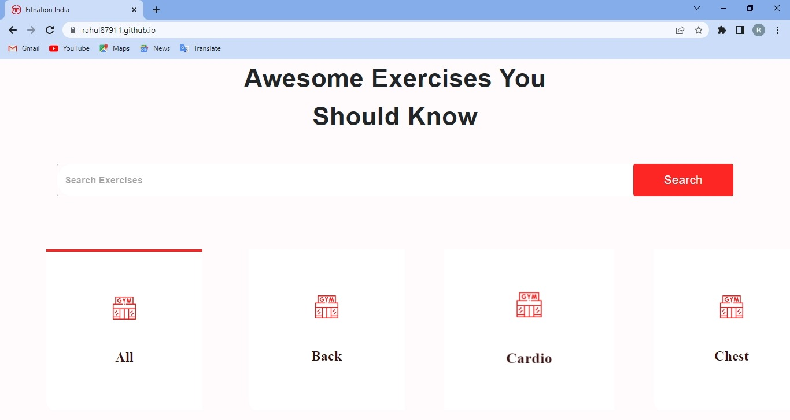
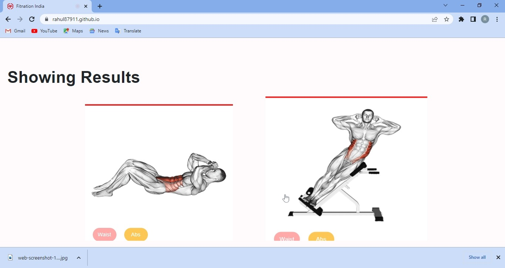
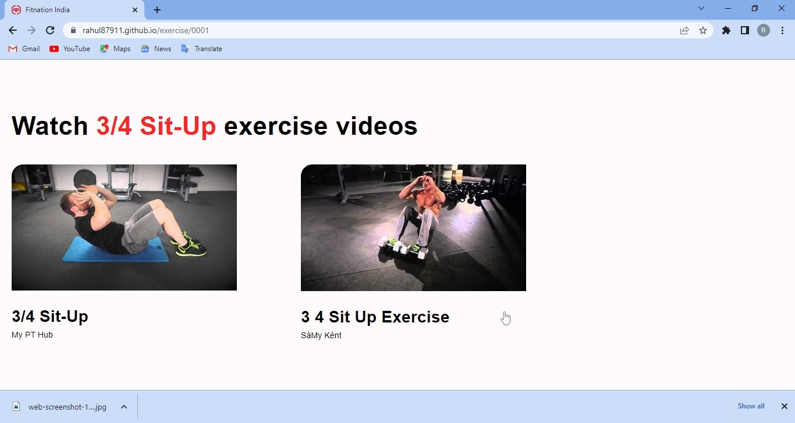
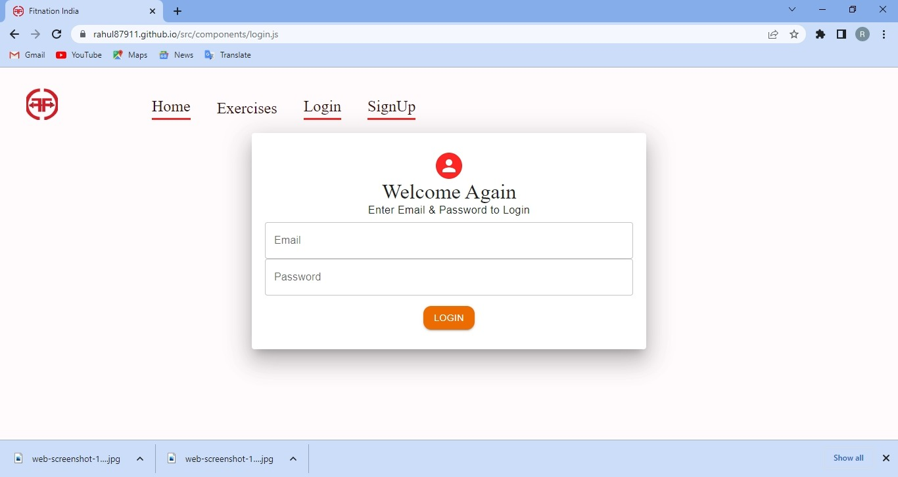
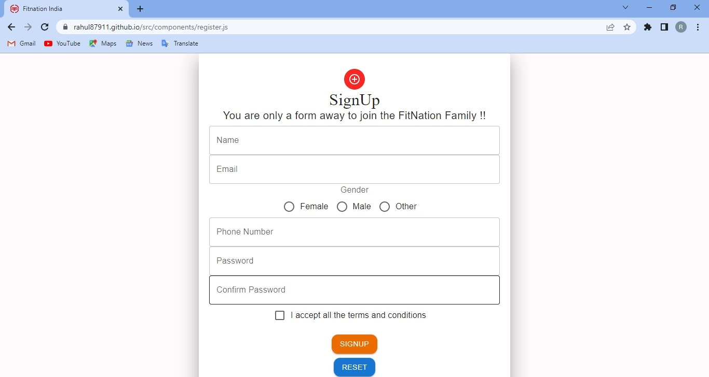
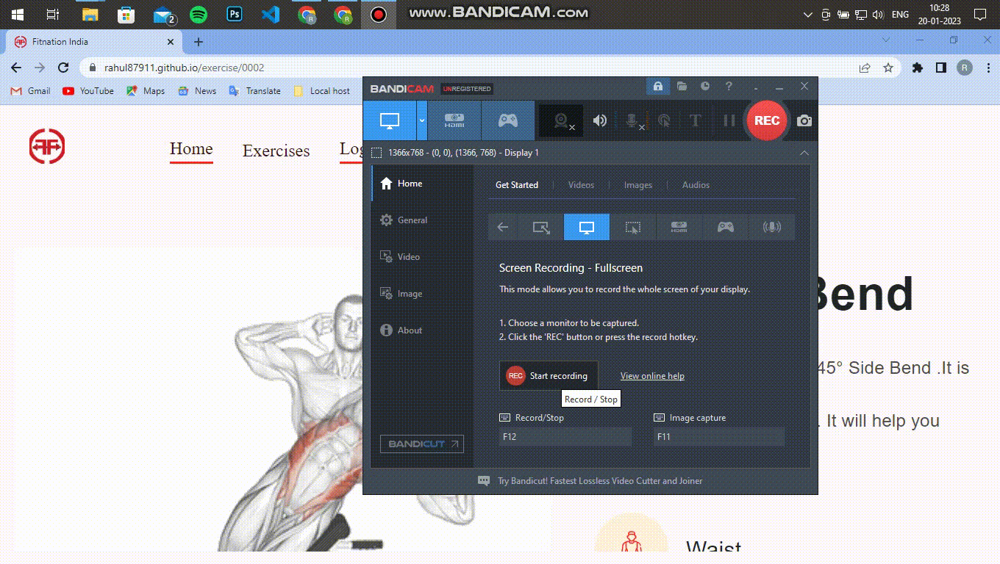
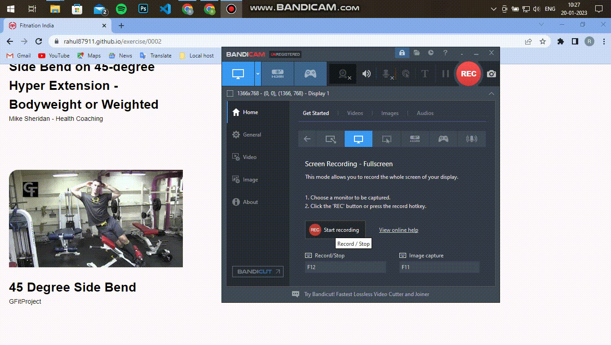

# FitNation India:

<p float="left">
  
   
   
   
   
    
     
</p>

- Build a webapp to facilitate a fitness enthusiast and aid him in attaining different kinds of fitness goals ,by giving him quality knowledge
about different biophysical movements in exercises targeting different muscles.
- Above are the snaps of :(Homepage, Searchbar, Exercise Card, Details Page, Videos Page, Login & Signup Forms)
- It covers explanation of more than 500 biophysical movements.
- Frontend of this app is built on `React js` using the languages `HTML,CSS,JAVASCRIPT`.
- It fetches the data from `Rapid API`.

# Functionalities

- The `Homepage` welcomes you with the motivational quote and the banner of creater.It has four button in navbar `HOME`, `EXERCISES` , `LOGIN`, `SIGNUP`.
-`HOME` will redirect you to homepage, as we scroll down we see a `SEARCHBAR` where we can search our desired muscle group ,below which we get different `CARDS` of exercises.
- After clicking onthe `CARD` it will redirect us to the details page which will gives us the details related to the exercise  ,alongwith supporting gifs and videos recommendations.
- After clicking on video link it will redirect us to the video page.
- In the navbar as we click on the `LOGIN` it will open the loginform for us.
- As we clickon `SIGNUP` it will load the signup form for us.
- 80% of app is written in Javascript.

## API Reference

- API is fetched through `fetchdata.js` under `utils` folder in `src` , the method we used to fetch API is mentioned below:
#### Get all items

```http
  GET /api/items
```

| Parameter | Type     | Description                |
| :-------- | :------- | :------------------------- |
| `api_key` | `string` | **Required**. Your API key |

#### Get item

```http
  GET /api/items/${id}
```

| Parameter | Type     | Description                       |
| :-------- | :------- | :-------------------------------- |
| `id`      | `string` | **Required**. Id of item to fetch |


# Live Preview





# credits

- RAHUL MISHRA (https://github.com/rahul87911)
- Thank You for visiting here.


